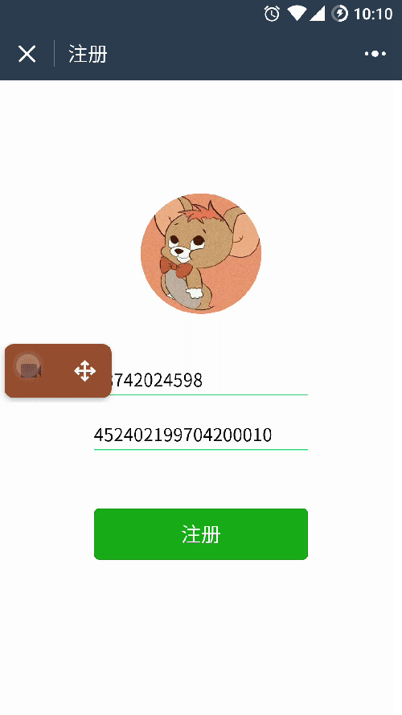
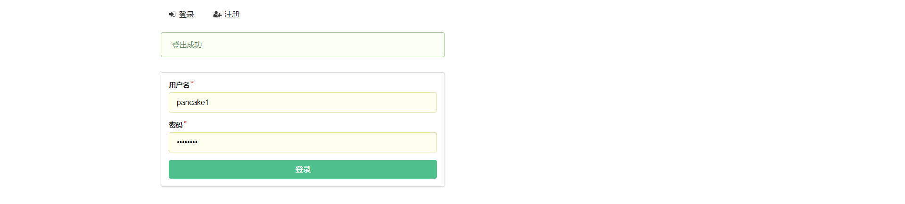
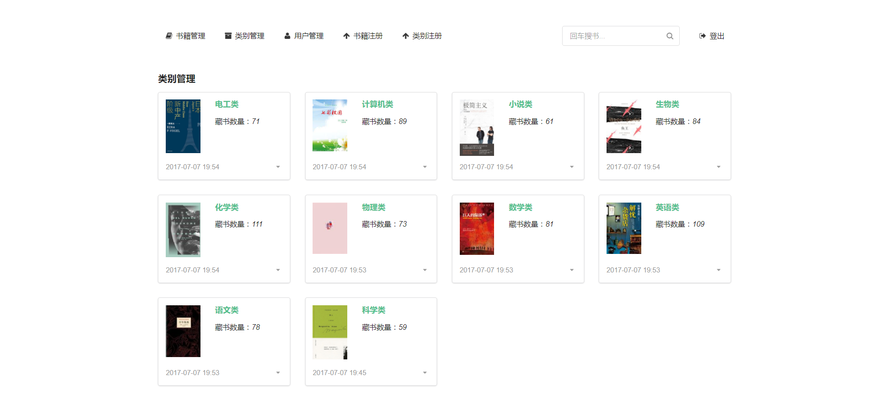
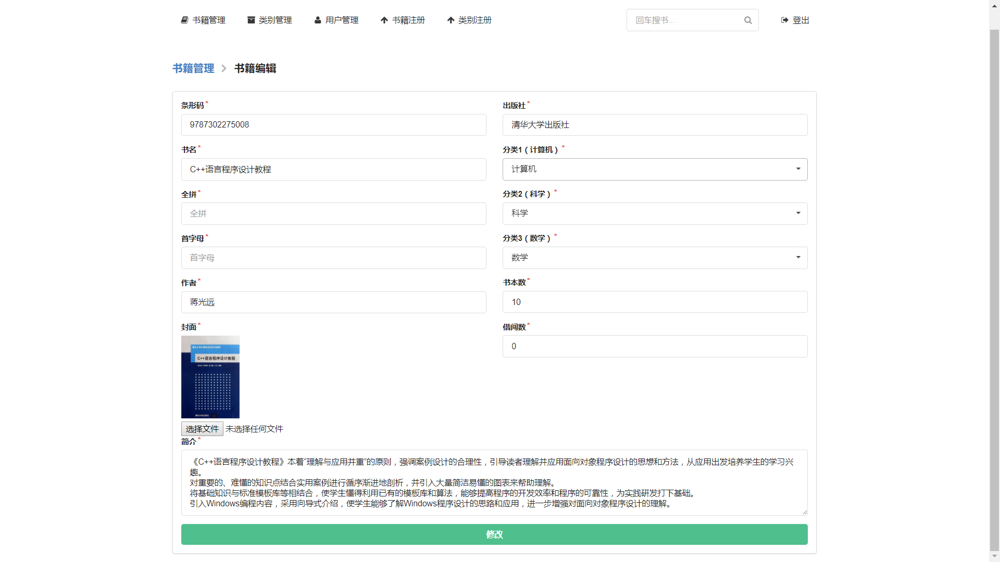
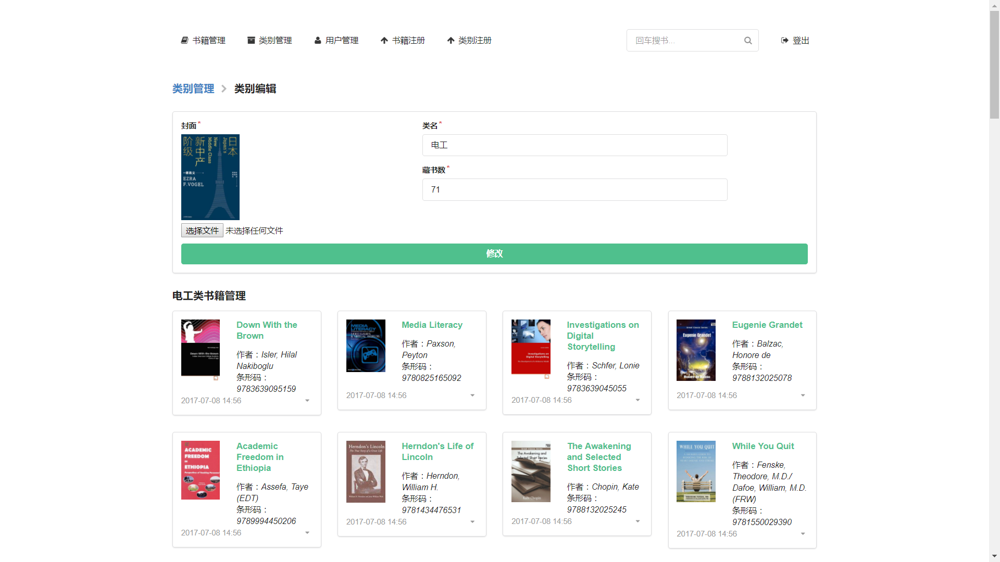
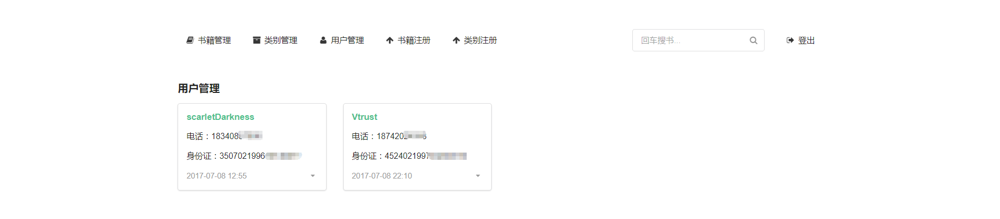
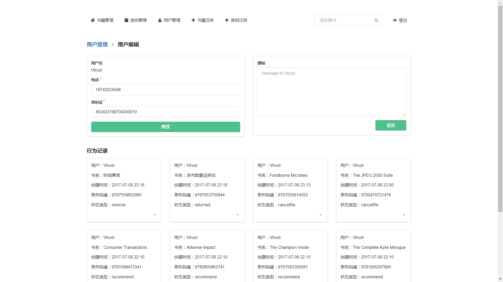
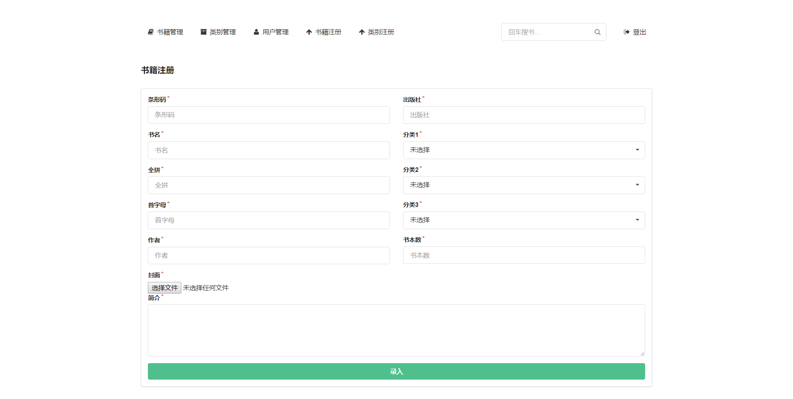
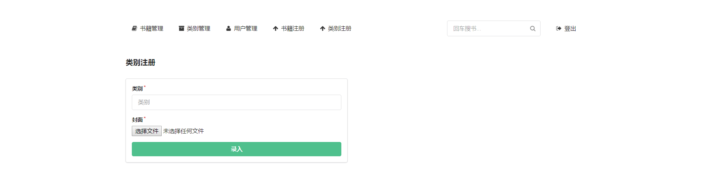

<p align="center">
    
</p>

# “无微不至”的借阅伴侣  
一个基于 微信小程序+Node.js+mongoDB 的图书馆借阅系统。  
[![Npm Version][npm-image]][npm-url]
[![Node Version][node-image]][node-url]
[![Mongodb Version][mongodb-image]][mongodb-url]
[![Linux Build][linux-image]][linux-url]
[![Wechat Tool][wechat-image]][wechat-url]
## 目录
>测试网址位于使用说明

 * [背景](#背景)
 * [设计理念](#设计理念)
 * [必要条件](#必要条件)
 * [功能描述](#功能描述)
   * [微信用户端功能描述](#微信用户端功能描述)
   * [微信管理员端功能描述](#微信管理员端功能描述)
   * [网页管理员端功能描述](#网页管理员端功能描述)
 * [使用说明](#使用说明)
   * [微信用户端使用说明](#微信用户端使用说明)
   * [微信管理员端使用说明](#微信管理员端使用说明)
   * [网页管理员端使用说明(测试网址)](#网页管理员端使用说明)
 * [部署](#部署)
 * [更新日志](#更新日志)
 * [主要参考资料](#主要参考资料)
 * [贡献者](#贡献者)

## 背景
第六届“中国软件杯”大学生软件设计大赛赛题。意在制作一款方便人们借阅图书的软件，以提高人们的精神生活水平。   
[大赛官网](http://www.cnsoftbei.com/)
## 设计理念
- 界面简洁大方
- 操作方便快捷
## 必要条件
程序要求在以下环境中运行：
- [Node.js v6.10.3+](https://nodejs.org/en/download/)
- [npm v3.10.10+](https://www.npmjs.com/)
- [mongoDB v3.4.2+](https://www.mongodb.com/download-center#community)
- [微信开发工具 0.18.182200+](http://mp.weixin.qq.com/debug/wxadoc/dev/devtools/download.html)

## 功能描述

### 微信用户端功能描述：
- 用户注册、登陆：  
如果用户已经注册，则登录直接小程序。如果没有注册，则跳转到注册页面。
- 图书导航：  
用户可以通过图书导航界面找到不同分类的书籍，书籍在注册时已经被归入不同的分类。
- 搜索书籍：  
用户可以通过关键字、图书作者、图书编号等搜索书籍。系统以列表的形式进行展示。列表的内容包括缩图、标题、作者、藏书量、简介。
除此以外，用户可以通过微信的扫码功能扫描书籍的isbn编号直接获得图书的信息。
- 书籍详情：  
用户能够查看书籍的详情，包括书籍的标题、出版社、版本号、封面、内容简介和藏书量等信息。
- 相关书籍：  
用户在查看一本书的时候，系统可以向用户推荐其它相关书籍给用户。
- 推荐阅读：  
系统可以定期给用户推荐书籍。
如果用户觉得困扰，可以手动关闭推荐。
- 在线预订：  
注册用户可以在线预订书籍。指定具体时间去图书馆取书。如果不巧暂时没有藏书，用户可以选择当有用户归还书籍后系统自动给他推送信息提醒。
- 借书：
借书成功时，界面立即显示借书成功。
- 还书：
还书成功时，界面立即显示还书成功。
- 还书提醒：  
本书借出去有还书提醒，系统从倒计时1周开始每天给用户进行推送提醒。
- 超期提醒：  
本书借出去有超期提醒，系统每天对于超期未还的用户进行提醒。

### 微信管理员端功能描述
- 管理员登陆：
输入管理员账号、密码进行登陆。
- 借出书籍：
扫描用户提供的借书二维码后界面显示相关书籍的信息，管理员核对信息后点击确认即可借出图书，并给用户发送相应消息。取消则不借出。
- 收回书籍：
扫描用户提供的还书二维码后界面显示相关书籍的信息，管理员核对信息后点击确认即可收回图书，并给用户发送相应消息。取消则不收回。

### 网页管理员端功能描述：
- 书籍管理：  
对图书馆内图书信息进行删、查、改。
- 类别管理：  
对图书类别信息进行删改。在一个类别下还可以对这一个类别下的图书进行删、查、改。
- 用户管理：  
对用户信息进行删改，并且可以删改用户借书、还书、预订等信息。
- 书籍注册：  
向图书馆内录书书籍。
- 类别注册：
向图书馆内增加图书类别。

## 使用说明
### 微信用户端使用说明
>由于网站域名审核需要时间，所以可能无法提供手机端的使用测试，可用微信开发者工具进行模拟测试

#### 运行环境配置

- 安装git
  - 下载[git](https://git-scm.com/)
  - 默认设置安装即可

- 安装微信开发者工具
  - 一台windows或mac电脑
  - 下载相应平台[开发者工具](http://mp.weixin.qq.com/debug/wxadoc/dev/devtools/download.html)
  - 默认设置安装即可

- clone微信用户端源码
  - `$ git clone https://github.com/Vtrust/wechatLibraryApp`

- 打开微信开发者工具
  - 扫码登陆
  - 添加项目
  - 选择绿色'无AppID'按钮
  - 填写项目名称
  - 选择上一步clone下来的文件夹
  - 点击添加项目即可运行
  

#### 程序使用方法
- 用户登陆：  
第一次登陆需要填写电话和身份证，填写后点击注册按钮进行注册。之后登陆不在需要填写，直接登陆。注册后跳转个人主页。  
- 查看个人信息：
点击个人主页左上角的用户头像可以进入个人中心，并且可以设置开关来打开推荐栏。  


- 预订和取消预订：
点击个人主页预订/推荐栏中的书籍封面可以进入书籍详情页面(或从分类详情中进入)，点击相关书籍详情页面的预订/取消预订按钮进行预订/取消预订，预订后会产生状态二维码用于借书功能实现。
- 查看个人消息：  
点击个人主页右上角通知图标进入消息中心。可以删除单条消息，也可以删除所有消息。  


- 分类查看书籍：  
  - 点击底栏的图书馆按钮进入图书馆页面。
  - 点击图书馆页面的分类进入分类详情页面。  
  - 点击分类详情页面的一本书籍进入相关书籍页面。
- 书籍搜索：  
  - 点击图书馆页面的搜索框进行书籍搜索，也可以点击搜索栏展开的历史记录直接搜索。
  - 点击图书馆页面的扫码按钮进扫码搜索。  
  

### 微信管理员端使用说明
#### 运行环境配置
- 安装git
  - 下载[git](https://git-scm.com/)
  - 默认设置安装即可

- 安装微信开发者工具
  - 一台windows或mac电脑
  - 下载相应平台[开发者工具](http://mp.weixin.qq.com/debug/wxadoc/dev/devtools/download.html)
  - 默认设置安装即可

- clone微信管理员端源码
  - `$ git clone https://github.com/Vtrust/wechatLibraryManager.git`

- 打开微信开发者工具
  - 扫码登陆
  - 添加项目
  - 选择绿色'无AppID'按钮
  - 填写项目名称
  - 选择上一步clone下来的文件夹
  - 点击添加项目即可运行

#### 程序使用方法
- 管理员登陆：
输入管理员账号和密码后点击登陆即可。没账号的先到[网页端](https://www.damiangao.cn/managerSignup)进行注册成功后再登陆。

- 借书：
点击中间的扫码按钮，扫描用户提供的借书二维码后界面显示相关书籍的信息，管理员核对信息后点击确认即可借出图书，并给用户发送相应消息。取消则不借出。
- 还书：
点击中间的扫码按钮，扫描用户提供的还书二维码后界面显示相关书籍的信息，管理员核对信息后点击确认即可收回图书，并给用户发送相应消息。取消则不收回。  


### 网页管理员端使用说明
#### 运行环境配置
- 安装有浏览器的pc

#### 程序使用方法
- 管理员注册：  
点击右上角注册，输入账号、密码以及密钥（1479833945）点击注册即可。

  
---

- 管理员登陆：  
点击右上角登陆，输入账号、密码点击登陆即可。


---

- 书籍管理：
点击编辑进入编辑界面，保存后即更改，点击删除则删除书本。


---

---

- 类别管理：  
点击编辑进入编辑界面，保存后即更改，点击删除则删除类别。
点击分类下书籍的编辑进入编辑界面，保存后即更改，点击删除则删除书本。


---

- 用户管理：  
点击编辑进入编辑界面，保存后即更改，点击删除则删除用户。


---

---

- 书籍注册：  
输入信息后点击注册即可。


---

- 类别注册：  
输入信息后点击注册即可。


---

- 登出：  
点击右上角登出按钮。

## 部署
>以腾讯云平台进行部署

### 购买云服务器
- centos系统

### 云服务器配置
>数据库使用了[MLab](https://mlab.com/)，所以不需要在服务器安装mongoDB

- 输入ip连接云服务器
- 输入账号和密码登陆云服务器
- 安装gti  
`$ yum install git`
- 安装Node.js  
`$ yum install node.js`
- 使用淘宝镜像加速npm  
`$ npm install -g cnpm --registry=https://registry.npm.taobao.org`
- 安装ngnix  
[ngnix安装教程链接](http://www.linuxidc.com/Linux/2016-09/134907.htm)  
**注意：** 由于需要使用SSL证书，所以在编译时使用`$ ./configure --with-http_ssl_module`而不是简单的`$ ./configure`  
[ngnix配置教程链接](http://www.cnblogs.com/vajoy/p/6092240.html)

### 云服务器部署
- clone 后台代码  
`$ git clone https://github.com/Vtrust/wechatLibraryServerTest`
- 进入文件目录  
`$ cd wechatLibraryServerTest`
- 安装包依赖  
`$ cnpm install`
- 安装pm2(一个带有负载均衡功能的Node应用的进程管理器)  
`$ cnpm install pm2`
- 启动服务器
```
$ npm start
$ pm2 start index.js
```
- 启动ngnix  
[ngnix安装教程链接](http://www.linuxidc.com/Linux/2016-09/134907.htm) 中的启动部分

- 进行访问测试

## 更新日志
- 2017-6-29
  - 上传第一版文件
  - 新增README文件
- 2017-6-30
  - 全新管理员工具界面，更简洁直观
  - 微信端管理员借书还书工具
- 2017-7-5
  - 开始手机端测试
  - 全新**推荐算法**(按照读者历史记录中书名、作者、分类、出版社、书籍的阅读量等信息进行推荐)
  - 增加**websocket**即时消息提醒
  - 优化前端网络请求次数
  - 使用豆瓣图书API录书
  - 增加个人主页红色消息提醒图标，消息提醒更直观
  - 增加还书时间显示
  - 增加预约书籍保留时间显示
  - 更改微信端界面配色
- 2017-7-8
  - 新增微信管理员端，包含借书和还书功能
  - 在个人中心、书籍详情页增加下拉刷新
  - 在分类详情、搜索页增加触底加载功能，减少单次数据传送事件
  - 优化书籍详情页面信息显示，增加了取消资源等待选项

## 主要参考资料
- [一起学 Node.js](https://github.com/nswbmw/N-blog(https://github.com/nswbmw/N-blog)
- [ngnix安装教程](http://www.linuxidc.com/Linux/2016-09/134907.htm)

## 贡献者
- LaoMing Zhang
- HaoRan Gao
- MingYang Liu

Email：vtrust32@gmail.com


[node-image]:https://img.shields.io/badge/node-v6.10.3-green.svg
[node-url]: https://nodejs.org/en/download/
[mongodb-image]:https://img.shields.io/badge/mongodb-v3.4.2-yellowgreen.svg
[mongodb-url]: https://www.mongodb.com/download-center#community
[npm-image]: https://img.shields.io/badge/npm-3.10.10-blue.svg
[npm-url]: https://www.npmjs.com/
[linux-image]: https://img.shields.io/badge/centOS-passing-orange.svg
[linux-url]: https://www.centos.org/download/
[wechat-image]: https://img.shields.io/badge/wechat-17.06.22-yellowgreen.svg
[wechat-url]:https://servicewechat.com/wxa-dev-logic/download_redirect?type=x64&from=mpwiki
