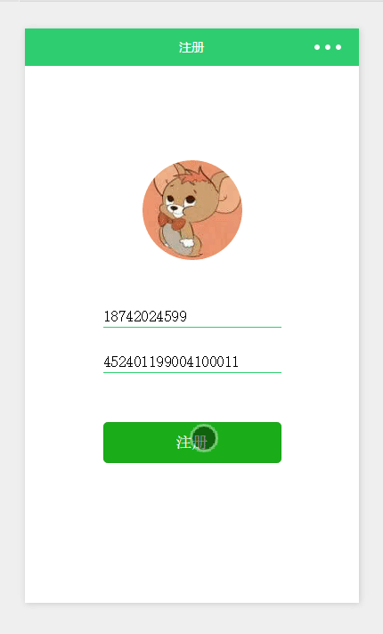
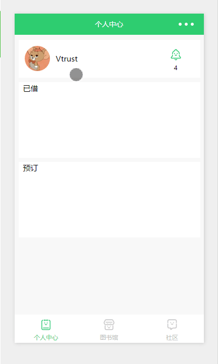
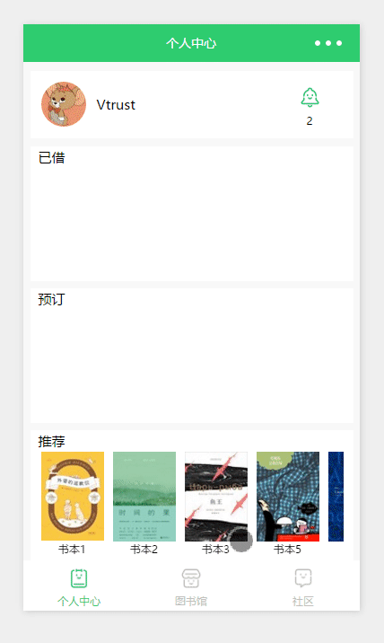
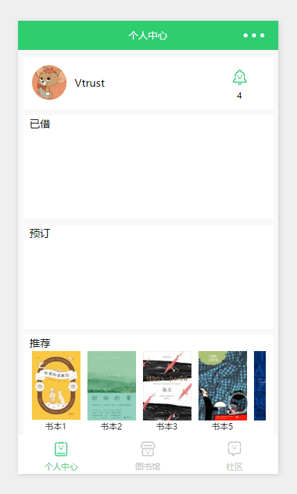
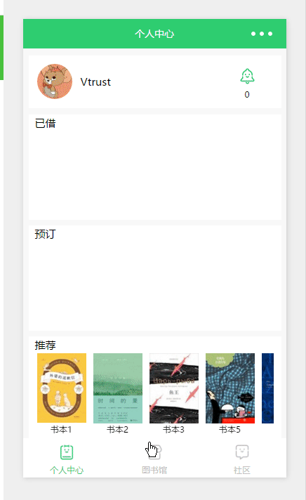
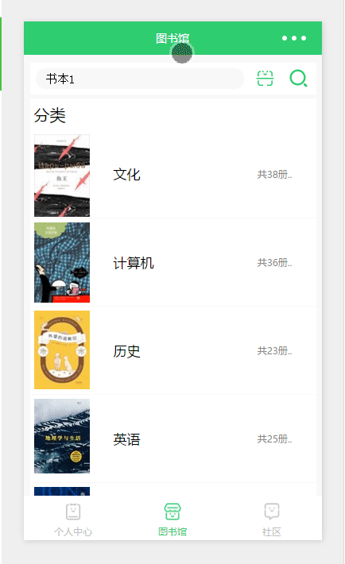
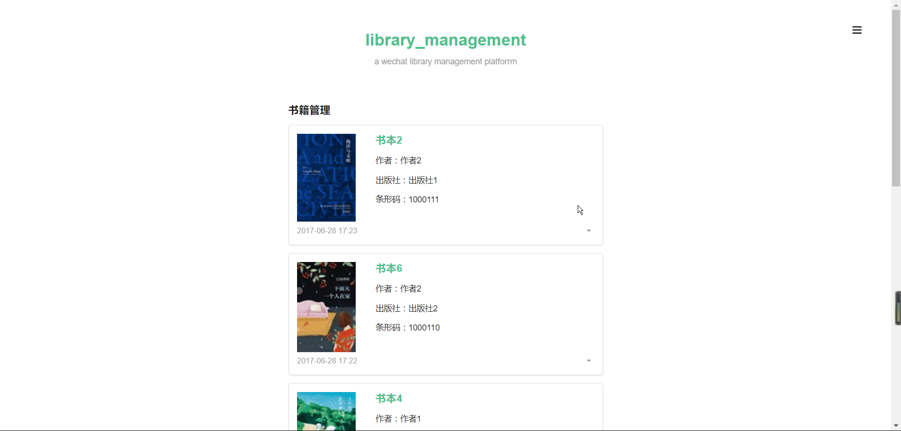
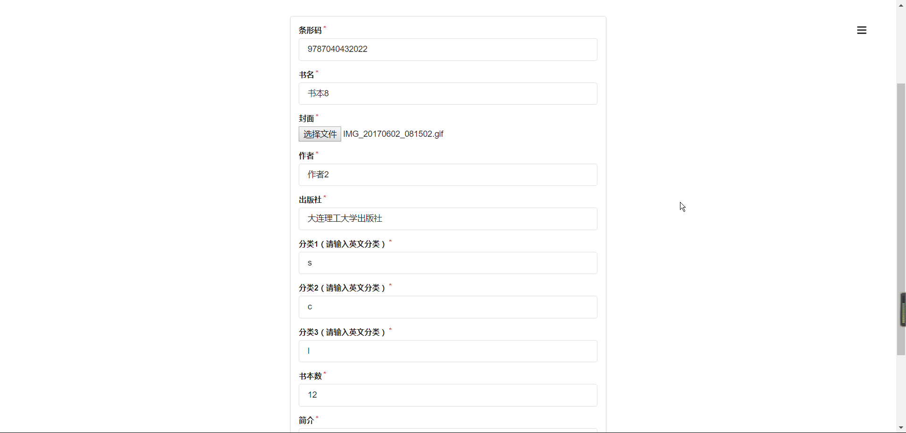

# “无微不至”的借阅伴侣
一个基于 微信小程序+Node.js+mongoDB 的图书馆借阅系统。   
[![Npm Version][npm-image]][npm-url]
[![Node Version][node-image]][node-url]
[![Mongodb Version][mongodb-image]][mongodb-url]
[![Linux Build][linux-image]][linux-url]
[![Wechat Tool][wechat-image]][wechat-url]
## 目录
 * [背景](#背景)
 * [必要条件](#必要条件)
 * [功能描述](#功能描述)
   * [微信端功能描述](#微信端功能描述)
   * [网页管理员端功能描述](#网页管理员端功能描述)
 * [使用说明](#使用说明)
   * [微信端使用说明](#微信端使用说明)
   * [网页管理员端使用说明(提供了测试网址)](#网页管理员端使用说明)
 * [部署](#部署)
 * [更新日志](#更新日志)
 * [贡献者](#贡献者)

## 背景
第六届“中国软件杯”大学生软件设计大赛赛题。意在制作一款方便人们借阅图书的软件，以提高人们的精神生活水平。   
[大赛官网](http://www.cnsoftbei.com/)
## 必要条件
程序要求在以下环境中运行：
- [Node.js v6.10.3+](https://nodejs.org/en/download/)
- [npm v3.10.10+](https://www.npmjs.com/)
- [mongoDB v3.4.2+](https://www.mongodb.com/download-center#community)
- [微信开发工具 0.18.182200+](http://mp.weixin.qq.com/debug/wxadoc/dev/devtools/download.html)

## 功能描述

### 微信端功能描述：
- 用户注册：  
如果用户已经注册，则登录小程序。如果没有注册，则跳转到注册页面
- 图书导航：  
用户可以通过图书导航界面找到不同分类的书籍，书籍在注册时已经被归入不同的分类。
- 搜索书籍：  
用户可以通过关键字、拼音全拼或者首字母、图书编号等搜索书籍。系统以列表的形式进行展示。列表的内容包括缩图、标题、作者、藏书量。
除此以外，用户可以通过微信的扫码功能扫描书籍的isbn编号直接获得图书的信息。
- 书籍详情：  
用户能够查看书籍的详情，包括书籍的标题、出版社、版本号、封面、内容简介和藏书量等信息。
- 相关书籍：  
用户在查看一本书的时候，系统可以向用户推荐其它相关书籍给用户。
- 推荐阅读：  
系统可以定期给用户推荐书籍。
如果用户觉得困扰，可以手动关闭推荐。
- 在线预订：  
注册用户可以在线预订书籍。指定具体时间去图书馆取书。如果不巧暂时没有藏书，用户可以选择当有用户归还书籍后系统自动给他推送信息提醒。
- 还书提醒：  
本书借出去有还书的提醒，系统从倒计时1周开始每天给用户进行推送提醒。
- 还书：  
图书上贴有二维码，用户在图书馆可以使用应用的扫码功能将书放入借书栏。

### 网页管理员端功能描述：
- 书籍管理：  
对图书馆内图书信息进行删改
- 类别管理：  
对图书类别信息进行删改
- 用户管理：  
对用户信息进行删改，并且可以删改用户借书、还书、预订等信息
- 书籍注册：  
向图书馆内录书书籍
- 类别注册：
增加图书类别

## 使用说明
### 微信端使用说明
>由于网站域名审核需要时间，所以暂时无法提供手机端的使用测试，可用微信开发者工具进行模拟测试

#### 运行环境配置

- 安装git
  - 下载[git](https://git-scm.com/)
  - 默认设置安装即可

- 安装微信开发者工具
  - 一台windows或mac电脑
  - 下载相应平台[开发者工具](http://mp.weixin.qq.com/debug/wxadoc/dev/devtools/download.html)
  - 默认设置安装即可

- clone微信小程序源码
  - `git clone https://github.com/Vtrust/wechatLibraryApp`

- 打开微信小程序
  - 扫码登陆
  - 添加项目
  - 选择绿色'无AppID'按钮
  - 填写项目名称
  - 选择上一步clone下来的文件夹
  - 点击添加项目即可运行
  

#### 程序使用方法
- 登陆：  
  
第一次登陆需要填写电话和身份证，填写后点击注册按钮进行注册。之后登陆不在需要填写，直接登陆。注册后跳转个人主页  
- 查看个人信息：  
   
点击个人主页左上角的用户头像可以进入个人中心，并且可以设置开关来打开推荐栏
- 预订和取消预订：  
  
点击个人主页已借/预订/推荐栏中的书籍封面可以进入书籍详情页面(或从分类详情中进入)，点击相关书籍页面的预订/取消预订按钮进行预订/取消预订，预订后会产生状态二维码用于借书功能实现
- 查看个人消息：  
  
点击个人主页右上角通知图标进入消息中心
- 分类查看书籍：  

  - 点击底栏的图书馆按钮进入图书馆页面
  - 点击分类详情页面的书籍进入相关书籍页面
  - 点击图书馆页面的分类进入分类详情页面  
- 书籍搜索：  

  - 点击图书馆页面的搜索框进行书籍搜索，也可以点击历史记录进行搜索
  - 点击图书馆页面的扫码按钮进扫码搜索  


### 网页管理员端使用说明
#### 运行环境配置
- 安装有浏览器的pc

#### 程序使用方法
[网页管理员端测试网址](https://www.damiangao.cn/books)
- 管理员注册：  
点击右上角注册，输入账号、密码以及密钥（1479833945）点击注册即可。
- 管理员登陆：  
点击右上角登陆，输入账号、密码点击登陆即可。
- 书籍管理：
  
点击编辑进入编辑界面，保存后即更改，点击删除则删除书本。
- 类别管理：  
gif图与书籍管理类似，点击编辑进入编辑界面，保存后即更改，点击删除则删除类别。
- 用户管理：  
gif图与书籍管理类似，点击编辑进入编辑界面，保存后即更改，点击删除则删除用户。
- 书籍注册：  
  
输入信息后点击注册即可。
- 类别注册：  
gif图与书籍注册类似，输入信息后点击注册即可。
- 登出：  
点击右上角登出按钮。

## 部署
>以腾讯云平台进行部署

### 购买云服务器
- centos系统

### 云服务器配置
>数据库使用了[MLab](https://mlab.com/)，所以不需要在服务器安装mongoDB

- 输入ip连接云服务器
- 输入账号和密码登陆云服务器
- 安装gti  
`$ yum install git`
- 安装Node.js  
`$ yum install node.js`
- 使用淘宝镜像加速npm  
`$ npm install -g cnpm --registry=https://registry.npm.taobao.org`
- 安装ngnix  
[ngnix安装教程链接](http://www.linuxidc.com/Linux/2016-09/134907.htm)  
**注意：** 由于需要使用SSL证书，所以在编译时使用`$ ./configure --with-http_ssl_module`而不是简单的`$ ./configure`  
[ngnix配置教程链接](http://www.cnblogs.com/vajoy/p/6092240.html)

### 云服务器部署
- clone 后台代码  
`$ git clone https://github.com/Vtrust/wechatLibraryServerTest`
- 进入文件目录  
`$ cd wechatLibraryServerTest`
- 安装包依赖  
`$ cnpm install`
- 安装pm2(一个带有负载均衡功能的Node应用的进程管理器)  
`$ cnpm install pm2`
- 启动服务器
```
$ npm start
$ pm2 start index.js
```
- 启动ngnix  
[ngnix安装教程链接](http://www.linuxidc.com/Linux/2016-09/134907.htm) 中的启动部分

- 进行访问测试

## 更新日志
- 2017-6-29：第一次提交

## 贡献者
- Zhang LaoMing  
- Gao HaoRan
- Liu MingYang

Email：vtrust32@gmail.com


[node-image]:https://img.shields.io/badge/node-v6.10.3-green.svg
[node-url]: https://nodejs.org/en/download/
[mongodb-image]:https://img.shields.io/badge/mongodb-v3.4.2-yellowgreen.svg
[mongodb-url]: https://www.mongodb.com/download-center#community
[npm-image]: https://img.shields.io/badge/npm-3.10.10-blue.svg
[npm-url]: https://www.npmjs.com/
[linux-image]: https://img.shields.io/badge/centOS-passing-orange.svg
[linux-url]: https://www.centos.org/download/
[wechat-image]: https://img.shields.io/badge/wechat-17.06.22-yellowgreen.svg
[wechat-url]:https://servicewechat.com/wxa-dev-logic/download_redirect?type=x64&from=mpwiki
